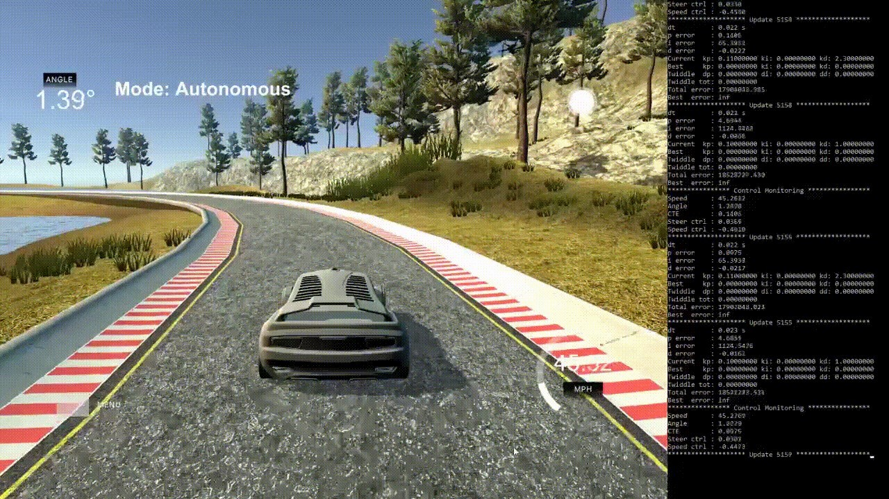

# **PID-Controller**

#### Udacity Self Driving Car Engineer Nanodegree Program - Term 2

## Project Introduction
The goal of the project is to implement and parameterize a PID controller in C ++ that keeps the car in the lane in the simulator. The simulator permanently provides the PID controller with the current lateral deviation from the target track (cross-tracking error), as well as the current steering angle and the current speed of the car. Based on these values, the PID controller must provide the steering and speed (throttle) control values so that the car remains in lane at the highest possible speed.


## Solution Description

### PID controller concept
A proportional-integral-derivative-controller ([PID controller](https://en.wikipedia.org/wiki/PID_controller)) is a control loop feedback mechanism widely used in industrial control systems and a variety of other applications requiring continuously modulated control. A PID controller continuously calculates an error value (deviation: `e(t)`) as the difference between a desired reference variable (setpoint: `r(t)`) and a measured process variable (actual value: `y(t)`) and applies a correction (control value: `u(t)`) based on proportional, integer, and derived terms (denoted by `P`, `I`, and `D`, respectively).


(Source: https://en.wikipedia.org/wiki/PID_controller)

The control value u(t) is calculated according to the following equation: 


* The term `P` is proportional to the current error `e(t)` (setpoint - actual value). That is, the control output `u(t)` is proportional to the deviation `e(t)`, the ratio being defined by the gain `kp`. When using the proportional control alone, however, an error remains.

* The term `I` sums the error values `e(t)` over time (integral). That is, the `I` term increases as the error increases and decreases as the error decreases, thus serving to remedy the remaining error. Via the gain factor `ki` is set how much the `I` term contributes to the control value `u(t)`.

* The term `D` is an estimate of the future trend of the error `e(t)` based on its current rate of change (derivative). That is, the faster the change, the greater the controlling or dampening effect of the `D` term. Via the gain factor `kd` is set how much the `D` term contributes to the control value `u(t)`.

### Controller Implementation
The controller was implemented in class [PID.cpp](src/PID.cpp) and consists of the following two main tasks:

**Error Calculation:**

Calculates the current errors based on the error and the current speed delivered by the simulator.

```
void PID::update_error(double error, double speed)
{
    if (update_count_ == 0)
    {
        p_error_ = error;
    }

    // Calculate errors  
    d_error_ = error - p_error_;
    i_error_ += error;
    p_error_ = error;
    
    ...
}
```

**Control Value Calculation:**

Calculates the current control value based on the current errors and the coefficients `kp`, `ki`, `kd`.

```
double PID::control()
{
   auto control = -1.0 * (p_[0] * p_error_ + p_[1] * i_error_ + p_[2] * d_error_);

    // Limit control between -1.0 and 1.0
    if (control > 1.0)
        control = 1.0;
    else if (control < -1.0)
        control = -1.0;

    return control;
}
```

### Hyperparameter Adjustment
The real challenge with this project was to determine the hyperparameters (`kp`, `ki`, `kd`) for the PID controller that controls the steering of the car so that it stays in the lane.

**Hyperparameter:**

|Coefficient|Responsibility|
|:----------|:-------------|
|kp         |Controls how much the control value for steering reacts to lateral deviations of the car from the  target path (cross-tracking error). Tends to oscillate or overshoot.|
|ki         |Compensates for the remaining control deviation of the pure P-controller over time.|
|kd         |Controls how much the control value for steering reatcs to the rate of change of lateral deviations of the vehicle from the target path (cross-tracking error). Dampens the oscillations.|

The parameters were determined by means of the [Twiddle algorithm](https://www.youtube.com/watch?v=2uQ2BSzDvXs), the procedure was as follows:

1. First, the parameters `kp`, `ki` and `kd` of the steering controller were chosen by trial and error, so that the car stays one lap in lane at a constant speed of about 10 mps (speed controller disabled).
2. In the second step, the parameter `kp` was optimized using the twiddle function at a constant speed of about 30 mps.
3. Next, the parameter `kd` was optimized by using the twiddle function. I omitted the parameter `ki` because it does not matter here.
4. Finally, I have activated the speed controller to dynamically adjust the target speed to the steering deflection. As a result, the car will run on straight sections at a higher speed while the speed is correspondingly reduced in curves. Here, a good result has already been achieved with the initial values.

**Final Parameters:**

Here are the finally used hyperparameters:

***Steering-Controller:***

|||
|----|------|
| kp | 0.11 |
| ki | 0.0  |
| kd | 1.23 |

***Speed-Controller:***

|||
|----|-----|
| kp | 0.1 |
| ki | 0.0 |
| kd | 1.0 |

### Demo
The following video shows the car driving one lap in the simulator:

[](https://youtu.be/cCA34V0hxpo)

## Dependencies

* cmake >= 3.5
 * All OSes: [click here for installation instructions](https://cmake.org/install/)
* make >= 4.1(mac, linux), 3.81(Windows)
  * Linux: make is installed by default on most Linux distros
  * Mac: [install Xcode command line tools to get make](https://developer.apple.com/xcode/features/)
  * Windows: [Click here for installation instructions](http://gnuwin32.sourceforge.net/packages/make.htm)
* gcc/g++ >= 5.4
  * Linux: gcc / g++ is installed by default on most Linux distros
  * Mac: same deal as make - [install Xcode command line tools]((https://developer.apple.com/xcode/features/)
  * Windows: recommend using [MinGW](http://www.mingw.org/)
* [uWebSockets](https://github.com/uWebSockets/uWebSockets)
  * Run either `./install-mac.sh` or `./install-ubuntu.sh`.
  * If you install from source, checkout to commit `e94b6e1`, i.e.
    ```
    git clone https://github.com/uWebSockets/uWebSockets 
    cd uWebSockets
    git checkout e94b6e1
    ```
    Some function signatures have changed in v0.14.x. See [this PR](https://github.com/udacity/CarND-MPC-Project/pull/3) for more details.
* Simulator. You can download these from the [project intro page](https://github.com/udacity/self-driving-car-sim/releases) in the classroom.

Fellow students have put together a guide to Windows set-up for the project [here](https://s3-us-west-1.amazonaws.com/udacity-selfdrivingcar/files/Kidnapped_Vehicle_Windows_Setup.pdf) if the environment you have set up for the Sensor Fusion projects does not work for this project. There's also an experimental patch for windows in this [PR](https://github.com/udacity/CarND-PID-Control-Project/pull/3).

## Basic Build Instructions

1. Clone this [repo](https://github.com/aboerzel/PID-Control.git).
2. Make a build directory: `mkdir build && cd build`
3. Compile: `cmake .. && make`
4. Run it: `./pid`. 

Tips for setting up your environment can be found [here](https://classroom.udacity.com/nanodegrees/nd013/parts/40f38239-66b6-46ec-ae68-03afd8a601c8/modules/0949fca6-b379-42af-a919-ee50aa304e6a/lessons/f758c44c-5e40-4e01-93b5-1a82aa4e044f/concepts/23d376c7-0195-4276-bdf0-e02f1f3c665d)
